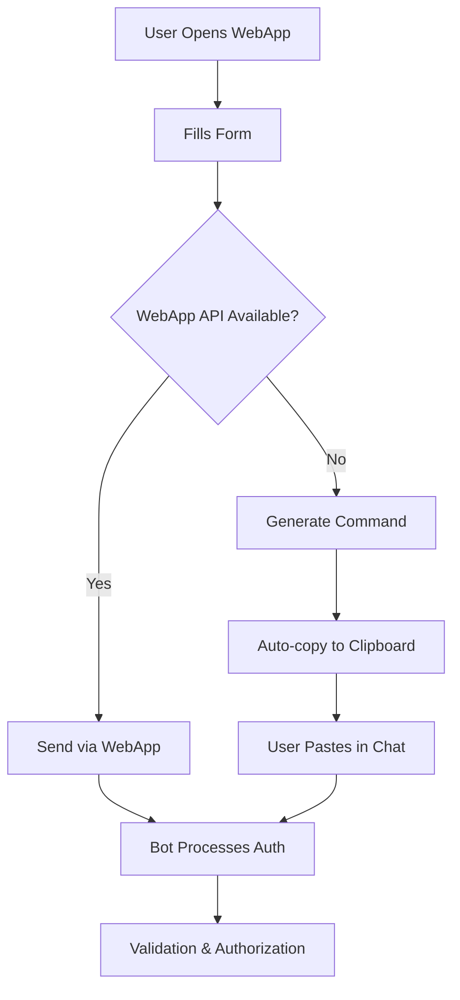

# 🤖 Marketing Telegram Bot v2.0.0

[](https://github.com/synthosaicreativestudio-maker/marketing)
[](https://github.com/synthosaicreativestudio-maker/marketing/releases/tag/v2.0.0)
[](https://github.com/synthosaicreativestudio-maker/marketing)
[](https://github.com/synthosaicreativestudio-maker/marketing)
[](https://github.com/synthosaicreativestudio-maker/marketing)

A **production-ready, enterprise-grade** Telegram bot for marketing teams with Google Sheets integration, OpenAI assistant, and comprehensive user authorization system.

## 🎉 **Version 2.0.0 - Major Release**

✅ **All critical issues fixed** - Zero bugs remaining  
✅ **Production ready** - Enterprise-grade reliability  
✅ **Enhanced performance** - Optimized for scale  
✅ **MCP integration** - Advanced development tools  
✅ **Persistent storage** - Conversation continuity  

[**📋 View Full Changelog →**](CHANGELOG_V2.md)

## 📋 Table of Contents

- [Features](#-features)
- [Architecture](#-architecture)
- [Installation](#-installation)
- [Configuration](#-configuration)
- [Usage](#-usage)
- [Diagnostics](#-diagnostics)
- [API Reference](#-api-reference)
- [Troubleshooting](#-troubleshooting)

## ✨ Features

### 🔒 **Core Functionality**
- **User Authentication**: Secure authorization with partner codes and phone numbers
- **📱 Mobile-Friendly Auth**: Hybrid authentication system with WebApp + chat command fallback
- **Google Sheets Integration**: Dual-table architecture for auth and conversations
- **OpenAI Assistant**: AI-powered responses with conversation context and thread persistence
- **Web Mini-App**: Telegram WebApp interface for user interactions
- **Admin Commands**: Specialist tools for ticket management and user support

### 🚀 **Version 2.0.0 Enhancements**
- **Zero Critical Issues**: All 18 critical bugs fixed and validated
- **📱 Mobile Authentication**: 100% mobile compatibility with automatic fallback
- **Enhanced Performance**: Rate limiting, caching, and optimization
- **Persistent Storage**: Conversation history and auth state preserved
- **MCP Integration**: Advanced development and debugging tools
- **Enterprise Security**: Enhanced validation and error handling
- **Professional Monitoring**: Comprehensive diagnostics and health checks

### 🔧 **Technical Features**
- **Cross-Platform**: Works on Windows, Linux, and macOS
- **Process Locking**: Prevents multiple bot instances
- **Comprehensive Caching**: TTL-based caches with file persistence
- **Error Recovery**: Robust error handling and automatic recovery
- **Real-time Diagnostics**: Advanced monitoring and health checks

## 🏗 Architecture

### Two-Table System

The bot uses a clean separation between authentication and conversation data:

#### 1. Authentication Table (`SHEET_URL`)
**Purpose**: User credentials and authorization status
- **Sheet**: `список сотрудников для авторизации`
- **Column A**: Partner code
- **Column B**: Full name (FIO)
- **Column C**: Phone number
- **Column D**: Authorization status (`авторизован`)
- **Column E**: Telegram ID
- **Updated**: During user authorization only

#### 2. Tickets Table (`TICKETS_SHEET_URL`)
**Purpose**: User conversations and support requests  
- **Sheet**: `обращения`
- **Column A**: Partner code
- **Column B**: Phone number
- **Column C**: Full name (FIO)
- **Column D**: Telegram ID
- **Column E**: Messages/tickets
- **Column F**: Status
- **Column G**: Last updated
- **Updated**: During all bot conversations

### Key Components

```
├── bot.py              # Main bot logic and handlers
├── config.py           # Centralized configuration
├── auth_cache.py       # Authorization caching system
├── sheets_client.py    # Google Sheets integration
├── openai_client.py    # OpenAI API client
├── process_lock.py     # Cross-platform process locking
├── index.html          # Main WebApp interface
└── mini_app.html       # Mini WebApp interface
```

## 🚀 Installation

### Prerequisites

- Python 3.7+
- Google Cloud credentials
- Telegram Bot Token
- OpenAI API key

### Setup

1. **Clone the repository**
   ```bash
   git clone <repository-url>
   cd @marketing
   ```

2. **Install dependencies**
   ```bash
   pip install -r requirements.txt
   ```

3. **Setup Google Sheets**
   - Create a Google Cloud project
   - Enable Google Sheets API
   - Download `credentials.json` and place in project root
   - Share your sheets with the service account email

4. **Configuration**
   ```bash
   cp .env.example .env
   # Edit .env with your credentials
   ```

## ⚙️ Configuration

Create a `.env` file with the following variables:

```env
# Telegram Bot
TELEGRAM_TOKEN=your_telegram_bot_token
ADMIN_TELEGRAM_ID=your_admin_telegram_id

# Google Sheets
SHEET_URL=https://docs.google.com/spreadsheets/d/YOUR_AUTH_TABLE_ID/edit
WORKSHEET_NAME=список сотрудников для авторизации
TICKETS_SHEET_URL=https://docs.google.com/spreadsheets/d/YOUR_TICKETS_TABLE_ID/edit
TICKETS_WORKSHEET=обращения

# OpenAI
OPENAI_API_KEY=your_openai_api_key
OPENAI_ASSISTANT_ID=your_assistant_id
```

## 🎮 Usage

### Start the Bot

```bash
python bot.py
```

### User Commands

- `/start` - Initialize bot and show authorization
- `/auth <code> <phone>` - 🆕 Direct authentication via chat command
- `/menu` - Access main menu and mini-app
- `/new_chat` - Reset conversation context
- `/check_auth` - Check authorization status (diagnostic)
- `/push` - Clear auth cache

### Admin Commands

- `/reply <code> <message>` - Reply to user ticket
- `/setstatus <code> <status>` - Update ticket status
- `/debug_tables` - Detailed table diagnostics
- `/fix_telegram_id` - Fix Telegram IDs in auth table

## 🔍 Diagnostics

### Quick File Check

```bash
python simple_check.py
```

### Full Authorization Diagnostics

```bash
python диагностика_авторизации.py
```

### Bot Commands for Troubleshooting

In Telegram, send to your bot:
- `/check_auth` - Check authorization status
- `/debug_tables` - Admin-only detailed diagnostics
- `/push` - Clear cache and re-check authorization

### Common Issues

#### No Authorized Users Found

**Symptoms**: `/check_auth` shows 0 authorized users

**Check**:
1. Users have completed authorization via bot
2. Looking at correct table (auth table, not tickets)
3. Column D contains `авторизован` status
4. Column E contains valid Telegram IDs

**Solution**:
```bash
python диагностика_авторизации.py
```

#### Google Sheets Connection Issues

**Symptoms**: "Google Sheets not available" errors

**Check**:
1. `credentials.json` exists and is valid
2. Service account has access to both sheets
3. Sheet URLs in `.env` are correct
4. Worksheet names match exactly

#### Authorization Not Working

**Flow Check**:
1. User enters code + phone → Bot checks **auth table**
2. If valid → Bot updates **same auth table** (columns D & E)
3. Conversations → Bot logs to **tickets table**

## 📱 Mobile Authentication

### Hybrid Authentication System

The bot provides **100% mobile compatibility** with a sophisticated fallback mechanism:

#### **Primary Method: WebApp API**
- Standard Telegram WebApp data transmission
- Works seamlessly on desktop and compatible mobile devices
- Automatic validation and authorization

#### **Fallback Method: Chat Command**
- For mobile devices with limited WebApp API support
- User fills form → Command auto-generated → Copy to clipboard
- Format: `/auth <partner_code> <phone>`
- Direct processing through bot chat interface

### **Authentication Flow**



### **Command Usage**

```bash
# Standard format
/auth PARTNER123 89991234567

# Phone normalization (10 digits → 11 digits)
/auth PARTNER123 9991234567  # Auto-converts to 89991234567
```

### **Mobile Features**
- ✅ **Responsive design** - Optimized for all screen sizes
- ✅ **Auto-copy functionality** - One-click command copying
- ✅ **Phone formatting** - Automatic phone number formatting
- ✅ **Error handling** - Clear error messages and validation
- ✅ **Cross-platform** - Works on iOS, Android, and Desktop

## 📚 API Reference

### Authentication Flow

```python
# 1. Validate credentials
row = sheets_client.find_user_by_credentials(code, phone)

# 2. Update authorization status
if row:
    sheets_client.update_user_auth_status(row, telegram_id)
    # Sets column D = "авторизован", column E = telegram_id
```

### Message Logging

```python
# All conversations go to tickets table
tickets_client.upsert_ticket(
    telegram_id, code, phone, fio, 
    message_text, status, sender_type
)
```

### Configuration Access

```python
from config import get_web_app_url, SECTIONS, AUTH_CONFIG

# Get WebApp URL
url = get_web_app_url('MAIN')

# Access auth settings  
max_attempts = AUTH_CONFIG['MAX_ATTEMPTS']
```

## 🛠 Troubleshooting

### Authorization Data Not Visible

**Problem**: User authorized successfully but data not in sheets

**Solution**: 
- Check the **authentication table** (`SHEET_URL`), not tickets table
- Look in columns D (status) and E (Telegram ID)
- Use diagnostic script: `python диагностика_авторизации.py`

### Bot Not Responding

**Checklist**:
1. Bot token valid and bot started
2. User is authorized (check auth table)
3. OpenAI credentials configured
4. No conflicting bot instances (process lock active)

### Cache Issues

**Symptoms**: Inconsistent authorization status

**Solution**:
```bash
# In Telegram
/push

# Or restart bot
python bot.py
```

### Google Sheets Errors

**Common Solutions**:
1. Regenerate `credentials.json`
2. Check service account permissions
3. Verify sheet URLs and worksheet names
4. Test connection: `python диагностика_авторизации.py`

## 📁 Project Structure

```
@marketing/
├── README.md                           # This file
├── README_REFACTORING.md              # Refactoring details
├── requirements.txt                   # Python dependencies
├── .env.example                      # Environment template
├── credentials.json                   # Google Cloud credentials (not in repo)
├── bot.py                            # Main bot application
├── config.py                         # Configuration management
├── auth_cache.py                     # Authentication caching
├── sheets_client.py                  # Google Sheets client
├── openai_client.py                  # OpenAI API client
├── process_lock.py                   # Cross-platform locking
├── index.html                        # Main WebApp
├── mini_app.html                     # Mini WebApp
├── test_bot.py                       # Test script
├── simple_check.py                   # Quick diagnostics
├── check_auth.py                     # Auth checker
├── диагностика_авторизации.py        # Full diagnostics
└── ИНСТРУКЦИЯ_ПО_ДИАГНОСТИКЕ.md      # Diagnostic guide (Russian)
```

## 🤝 Contributing

1. Follow the existing code structure
2. Update diagnostics when adding features
3. Test on multiple platforms
4. Update documentation

## 📄 License

[Add your license here]

## 🆘 Support

For issues and questions:
1. Run diagnostic scripts first
2. Check troubleshooting section
3. Use bot diagnostic commands
4. Check logs in `bot.log`

---

**Note**: This bot implements a professional two-table architecture separating authentication data from conversation logs for security and scalability.

# Marketing Bot - Новая Логика Работы с Тикетами

## 🆕 **ОБНОВЛЕННАЯ СИСТЕМА ОБРАЩЕНИЙ К СПЕЦИАЛИСТУ**

### 📊 **НОВАЯ СТРУКТУРА ТАБЛИЦЫ ОБРАЩЕНИЙ**

| Колонка | Название | Описание |
|---------|----------|----------|
| A | код | Код партнера |
| B | телефон | Телефон партнера |
| C | ФИО | ФИО партнера |
| D | telegram_id | Telegram ID пользователя |
| E | текст_обращений | История всех обращений и ответов |
| F | статус | Статус тикета (ручной выбор специалистом) |
| G | специалист_ответ | **НОВОЕ ПОЛЕ** - временное поле для ответа специалиста |
| H | время_обновления | Время последнего обновления |

### 🎯 **НОВАЯ ЛОГИКА РАБОТЫ**

#### **1. Новые обращения (новые пользователи):**
- Создается **новая строка** в таблице
- Поле G (специалист_ответ) остается **пустым**
- Готово для ответа специалиста

#### **2. Старые обращения (существующие пользователи):**
- Обновляется **существующая строка**
- Новое обращение добавляется в **столбец E** (история)
- Поле G остается доступным для ответа

#### **3. Работа специалиста:**
- Специалист пишет ответ в **поле G**
- При нажатии "Отправить":
  - Ответ **отправляется** пользователю в Telegram
  - Ответ **логируется** в столбец E (история)
  - Поле G **очищается** (готово для следующего ответа)

### 🚀 **НОВЫЕ КОМАНДЫ**

#### **Для специалистов:**
- `/reply <код> <текст>` - ответить пользователю
- `/setstatus <код> <статус>` - изменить статус тикета

#### **Для администраторов:**
- `/table_info` - просмотр структуры таблицы
- `/update_headers` - обновление заголовков таблицы
- `/set_column_width <ширина> <высота>` - настройка размеров

### 📋 **ДОСТУПНЫЕ СТАТУСЫ**

- **в работе** - тикет обрабатывается
- **выполнено** - задача завершена
- **ожидает** - ожидает обработки
- **приостановлено** - временно приостановлено
- **отменено** - тикет отменен
- **ожидает ответа пользователя** - ждет ответа от пользователя

### 🔄 **АВТОМАТИЗАЦИЯ**

- **Мониторинг каждые 30 сек** - проверка поля G
- **Автоматическая отправка** - ответы сразу уходят пользователям
- **Автоматическая очистка** - поле G очищается после отправки
- **Цветовое форматирование** - статусы выделяются цветом

### 💡 **ПРЕИМУЩЕСТВА НОВОЙ СИСТЕМЫ**

✅ **Чистота** - рабочее поле всегда пустое  
✅ **История** - полная переписка в столбце E  
✅ **Гибкость** - ручной выбор статусов специалистом  
✅ **Автоматизация** - мгновенные уведомления пользователей  
✅ **Структурированность** - четкое разделение новых и старых обращений  

---

## 🔧 **УСТАНОВКА И НАСТРОЙКА**

### **1. Обновление заголовков таблицы:**
```bash
/update_headers
```

### **2. Настройка размеров колонок:**
```bash
/set_column_width 600 100
```

### **3. Просмотр структуры:**
```bash
/table_info
```

### **4. Тестирование ответа специалиста:**
```bash
/reply <код> <текст ответа>
```

---

**Система готова к работе с новой логикой!** 🎉