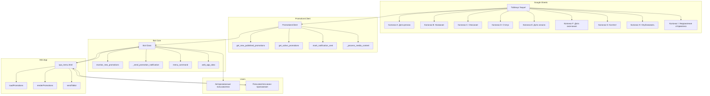
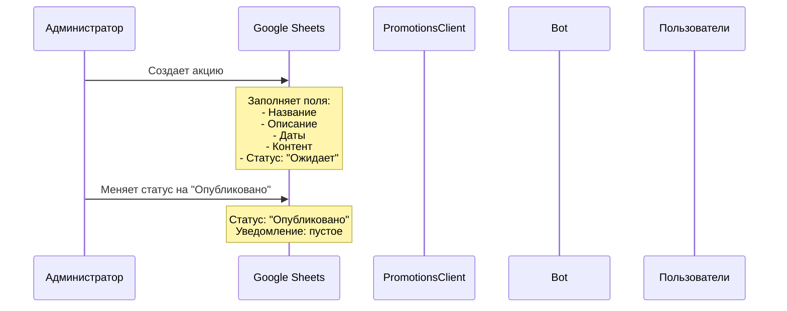
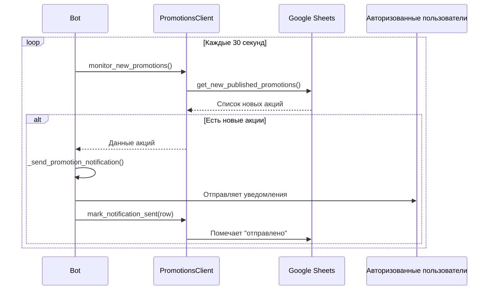
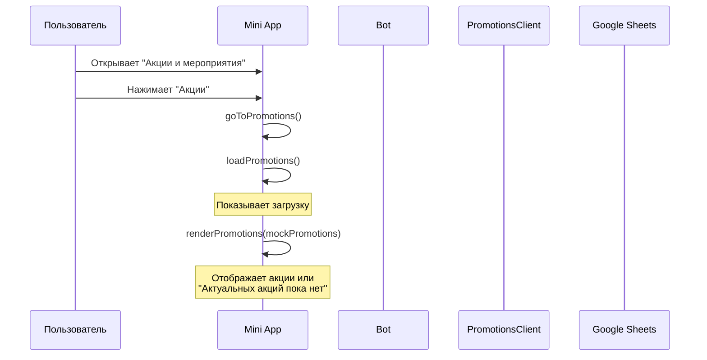
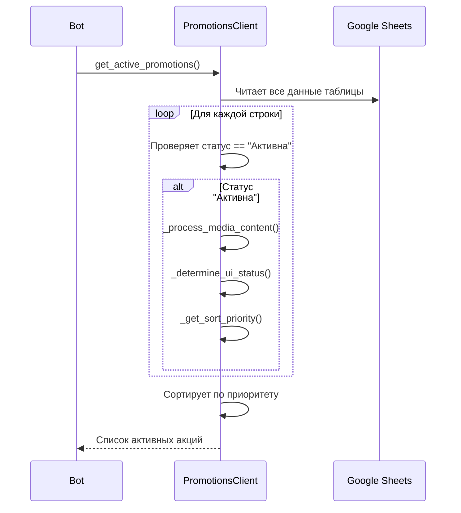
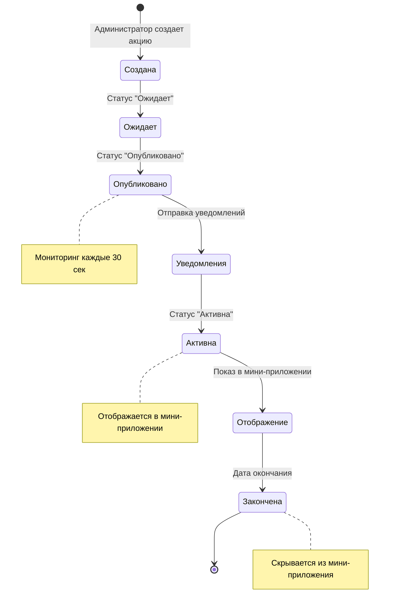

# 🎉 Диаграмма потока данных акций Marketing Bot

## 📊 Общая архитектура



## 🔄 Детальный поток данных

### 1. **Создание акции в Google Sheets**



### 2. **Мониторинг новых акций**



### 3. **Отображение акций в мини-приложении**



### 4. **Получение активных акций**



## 📋 Структура данных

### **Google Sheets структура:**

| Колонка | Поле | Описание | Пример |
|---------|------|----------|---------|
| A | Дата релиза | Дата создания акции | 01.01.2025 |
| B | Название | Название акции | "Новогодняя скидка" |
| C | Описание | Подробное описание | "Скидка 20% на все товары" |
| D | Статус | Статус акции | "Опубликовано", "Активна", "Закончена" |
| E | Дата начала | Дата начала акции | 01.01.2025 |
| F | Дата окончания | Дата окончания акции | 31.01.2025 |
| G | Контент | Медиа контент | "https://drive.google.com/..." |
| H | Опубликовать | Кнопка публикации | (кнопка) |
| I | Уведомление отправлено | Статус уведомления | "отправлено" |

### **Статусы акций:**

1. **"Ожидает"** - акция создана, но не опубликована
2. **"Опубликовано"** - акция опубликована, уведомления отправлены
3. **"Активна"** - акция активна и отображается в мини-приложении
4. **"Закончена"** - акция завершена

### **UI статусы для мини-приложения:**

1. **"active"** - акция активна (зеленый)
2. **"published"** - акция опубликована, скоро стартует (желтый)
3. **"finished"** - акция завершена (красный)

## 🔧 Обработка медиа контента

### **Поддерживаемые типы медиа:**

1. **Google Drive ссылки**
   - Конвертируются в прямые ссылки
   - Формат: `https://drive.google.com/uc?export=view&id={file_id}`

2. **YouTube ссылки**
   - Конвертируются в embed ссылки
   - Формат: `https://www.youtube.com/embed/{video_id}`

3. **Прямые ссылки на изображения**
   - `.jpg`, `.jpeg`, `.png`, `.gif`, `.webp`

4. **Прямые ссылки на видео**
   - `.mp4`, `.webm`, `.ogg`

### **Пример обработки контента:**

```python
# Входные данные
content = "https://drive.google.com/file/d/1ABC123/view, https://youtube.com/watch?v=xyz789"

# Результат обработки
media_list = [
    {'type': 'image', 'url': 'https://drive.google.com/uc?export=view&id=1ABC123'},
    {'type': 'video', 'url': 'https://www.youtube.com/embed/xyz789'}
]
```

## ⚙️ Конфигурация

### **PROMOTIONS_CONFIG:**

```python
PROMOTIONS_CONFIG = {
    'SHEET_NAME': 'Акции',
    'MONITORING_INTERVAL': 30,  # 30 секунд
    'CACHE_TTL': 600,  # 10 минут
    'NOTIFICATION_DELAY': 2,  # 2 секунды между уведомлениями
    'MAX_DESCRIPTION_LENGTH': 200,  # Максимальная длина описания
}
```

## 🚀 Жизненный цикл акции



## 🔍 Ключевые методы

### **PromotionsClient:**

1. **`get_new_published_promotions()`**
   - Ищет акции со статусом "Опубликовано" без отправленного уведомления
   - Возвращает список для отправки уведомлений

2. **`get_active_promotions()`**
   - Ищет акции со статусом "Активна"
   - Обрабатывает медиа контент
   - Определяет UI статус
   - Сортирует по приоритету

3. **`mark_notification_sent(row)`**
   - Помечает акцию как уведомление отправлено
   - Обновляет колонку "Уведомление отправлено"

4. **`_process_media_content(content)`**
   - Обрабатывает ссылки на медиа
   - Конвертирует Google Drive и YouTube ссылки
   - Определяет тип медиа (image/video)

### **Bot методы:**

1. **`monitor_new_promotions()`**
   - Фоновая задача каждые 30 секунд
   - Получает новые акции
   - Отправляет уведомления авторизованным пользователям

2. **`menu_command()`**
   - Обрабатывает команду /menu
   - Получает активные акции
   - Отправляет данные в мини-приложение

3. **`web_app_data()`**
   - Обрабатывает данные от мини-приложения
   - Валидирует JSON
   - Направляет к соответствующему обработчику

## 📱 Интеграция с мини-приложением

### **Отправка данных в мини-приложение:**

```javascript
// В spa_menu.html
function sendToBot(data) {
    const jsonData = JSON.stringify(data);
    tg.sendData(jsonData);
}
```

### **Получение данных в боте:**

```python
# В bot.py
async def web_app_data(self, update: Update, context: ContextTypes.DEFAULT_TYPE):
    raw_data = update.message.web_app_data.data
    payload = json.loads(raw_data)
    # Обработка данных...
```

## 🎯 Особенности реализации

1. **Асинхронная обработка** - все операции с Google Sheets выполняются в отдельных потоках
2. **Кэширование** - активные акции кэшируются на 10 минут
3. **Обработка ошибок** - все методы обернуты в try-catch блоки
4. **Логирование** - подробное логирование всех операций
5. **Валидация** - проверка JSON данных от мини-приложения
6. **Медиа обработка** - автоматическая конвертация ссылок
7. **Сортировка** - приоритетная сортировка акций для отображения

---

**Создано**: 2025-01-03 09:30  
**Версия**: 1.0  
**Статус**: Полный анализ функционала акций
