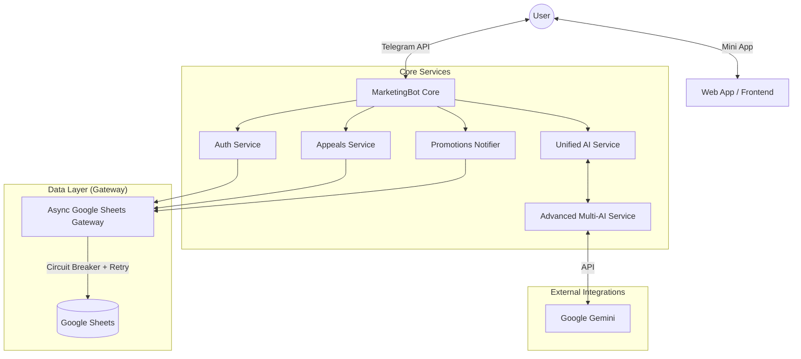

# Technical Documentation (v.Current)

> **Status:** Active / Stable
> **Last Updated:** 2026-01-16
> **Role:** Single Source of Truth

---

## 1. High-Level Architecture

The project is a resilient **Telegram Bot** built with Python, designed for high availability (24/7) and fault tolerance. It operates as a monolithic application with modular services, using **Google Sheets** as its primary database and **Google Gemini** as the only AI provider (no fallback providers).

### Technology Stack
*   **Runtime:** Python 3.10+
*   **Core Framework:** `python-telegram-bot` (v20+, Async)
*   **Database:** Google Sheets (via `gspread` + `tenacity` for retries)
*   **AI Engine:** Gemini only (`gemini-3-flash-preview`)
*   **Web Integration:** Flask (for Webhooks & Mini Apps)
*   **Deployment:** Systemd Service (Linux/Ubuntu)

### Architecture Diagram (Logical)



### Key Architectural Decisions
1.  **Gateway Pattern:** All interactions with Google Sheets go through `AsyncGoogleSheetsGateway`. This layer handles rate limiting, retries (exponential backoff), and connection stability.
2.  **Circuit Breaker:** Implemented to prevent cascading failures. If Google Sheets becomes unresponsive, the bot temporarily degrades functionality rather than crashing.
3.  **Graceful Shutdown:** The bot handles `SIGINT`/`SIGTERM` to safely close network connections and save state before exiting.
4.  **No Local Database:** The system is stateless regarding persistent data; all business data resides in Google Sheets. Runtime state is in-memory.

---

## 2. Data Structure

The "Database" implies a specific Google Spreadsheet with multiple worksheets.

### 2.1 Auth Sheet (Users)
Stores user registry and authentication status.

| Column | Name (Header) | Description |
| :--- | :--- | :--- |
| **A** | *Partner Code* | Unique identifier for the partner. (Used for search) |
| **B** | *Phone* | Partner's phone number. (Used for search) |
| **C** | *FIO* | Full Name. |
| **D** | **STATUS** | Auth Status (`authorized` / `avtorizovan`). |
| **E** | **Telegram ID** | Linked Telegram User ID. |
| **F** | **Updated At** | Timestamp of last auth change. |

> **Note:** Authorization matches a user by `Partner Code` AND `Phone`. If found, columns D, E, F are updated.

### 2.2 Appeals Sheet (Tickets)
Stores support tickets and chat history.

| Column | Index | Header | Description |
| :--- | :--- | :--- | :--- |
| **A** | 0 | Code | Partner Code. |
| **B** | 1 | Phone | Phone Number. |
| **C** | 2 | FIO | Full Name. |
| **D** | 3 | Telegram ID | User's Telegram ID. |
| **E** | 4 | **Text** | **Accumulated History**. Contains the entire chat log for the active ticket. |
| **F** | 5 | **Status** | Ticket Status (See below). |
| **G** | 6 | Specialist Answer| Draft answer from the specialist (to be sent by bot). |
| **H** | 7 | Updated At | Last modification timestamp. |

#### Status Lifecycle (Column F)
*   `Новое` (Color: #f3cccc) — Created by user, waiting for AI or Human.
*   `Ответ ИИ` (Color: #ffffff) — AI has replied.
*   `В работе` (Color: #fff2cc) — Acknowledged by specialist (or "Call Human" requested).
*   `Передано специалисту` (Color: #f3cccc) — Explicit escalation triggered.
*   `Решено` (Color: #d9ead3) — Ticket closed.

---

## 3. Business Logic & Algorithms

### 3.1 Authorization Flow
1.  User starts bot via `/start`.
2.  **Check:** `AuthService` checks `TTLCache` (in-memory) or queries Auth Sheet for `Telegram ID`.
3.  **If Unknown:** Bot requests Authorization via Web App (Mini App).
4.  **Web App:** User enters `Code` and `Phone`.
5.  **Validation:** Bot normalizes phone (e.g., `8999...`), searches Auth Sheet.
6.  **Success:** If match found -> Update Sheet (Col D, E, F) -> Update Cache -> Show Menu.
7.  **Failure:** Show error retry.

### 3.2 Chat & AI Flow (Hybrid)
1.  **Input:** User sends a text message.
2.  **Filter:** Is it an escalation keyword (e.g., "call human")?
    *   *Yes:* Halt AI, set Status `Передано специалисту`, show "Contact Specialist" button.
3.  **Check Status:** Is current ticket status `В работе` (In Work)?
    *   *Yes:* Silence AI. Log message to Sheet (Col E). Wait for human reply.
4.  **AI Execution:**
    *   Send text to **Advanced Multi-AI System** (Rotation: DeepSeek -> Gemini -> Qwen -> Llama).
    *   Receive response.
    *   **Post-Processing:** Check if AI suggests escalation ("Shall I connect you?").
    *   **Send:** Reply to user + Log to Sheet (Col E) + Set Status `Ответ ИИ`.

### 3.3 Specialist Response (Reverse Flow)
1.  **Monitor:** `ResponseMonitor` polls Appeals Sheet (Col G) every 60s.
2.  **Trigger:** Specialist writes text in Column G.
3.  **Action:**
    *   Bot sends text to User `telegram_id` (from Col D).
    *   Bot clears Column G.
    *   Bot appends text to History (Col E).

---

---

## 4. Integrations & API

### 4.1 Internal Services
*   **Google Sheets API:** Authenticated via Service Account JSON (`GCP_SA_FILE`).
*   **Advanced Multi-AI System:**
    *   **Gemini API:** Uses `GEMINI_API_KEYS` (rotation pool) and `gemini-2.0-flash` model.
    *   **OpenRouter API:** DISABLED (no fallback providers).
    *   **Proxy Support:** Configurable via `PROXYAPI_BASE_URL` for bypass regional restrictions.

### 4.2 Webhooks & Mini App
*   **Endpoint:** `/webhook/promotions` (Flask/Werkzeug).
*   **Purpose:** Receives POST requests (e.g., from Google Apps Script triggers) to broadcast promotions.
*   **Mini App:** Static HTML/JS files (`index.html`, `menu.html`) loaded inside Telegram WebObject.

### 4.3 Development History
*   The full history of technical decisions, feature additions, and versions is tracked in [CHANGELOG.md](docs/CHANGELOG.md).
*   Refer to **CHANGELOG** to see the evolution from the initial prototype to the current Micro-Service-like architecture.

---

---

## 5. Deployment / Development Guide

### 5.1 Project Structure (File Map)
For a beginner developer, here is what each file does:
*   `bot.py`: **Main Engine**. Starts the bot, connects services, handles errors. Start here.
*   `handlers.py`: **Brain**. Contains logic for `/start`, chat messages, and buttons. Edit this to change *what* the bot says.
*   `auth_service.py`: **Security**. Handles checking user permissions in Google Sheets.
*   `appeals_service.py`: **Support Ticket System**. Logic for creating/updating tickets in Sheets.
*   `sheets_gateway.py`: **Database Driver**. Low-level connector to Google Sheets with retry protection.
*   `gemini_service.py`: **AI Connector**. Handles Gemini pooling/rotation only (no fallback providers).

### 5.2 Setting Up Your Local Environment (Step-by-Step)
1.  **Install Python 3.10+**.
2.  **Clone the project** to your machine.
3.  **Create a Virtual Environment** (Isolated sandbox):
    ```bash
    python3 -m venv .venv
    source .venv/bin/activate  # On Windows: .venv\Scripts\activate
    ```
4.  **Install Dependencies**:
    ```bash
    pip install -r requirements.txt
    ```
5.  **Configure Secrets**:
    *   Copy `.env.example` to `.env`.
    *   Fill in `TELEGRAM_TOKEN`, `SHEET_ID`, etc.
    *   **Important:** If running in Russia, set `PROXYAPI_BASE_URL`.
    *   Ensure `credentials.json` (Google Service Account) is in the project folder.
6.  **Run the Bot**:
    ```bash
    python bot.py
    ```
    *If successful, you will see "Запуск бота..." in the console.*

### 5.3 Common Modification Scenarios

#### Scenario A: Changing the Welcome Message
1.  Open `handlers.py`.
2.  Find `start_command_handler`.
3.  Edit the text inside `await update.message.reply_text("...")`.
4.  Restart the bot (`Ctrl+C` then `python bot.py`) to see changes.

#### Scenario B: Adding a New Command (e.g., /help)
1.  Open `handlers.py`.
2.  Create a function `async def help_command(update, context): ...`.
3.  Go to `setup_handlers` function in `handlers.py`.
4.  Add `application.add_handler(CommandHandler("help", help_command))`.

#### Scenario C: Debugging "Why did the bot crash?"
1.  Check `bot.log` file.
2.  Look for "CRITICAL" or "ERROR" lines.
3.  If it's a Google Sheets error, check `sheets_gateway.py` logs.

---

## 6. Production Deployment (Server)

The bot runs on a **Yandex Cloud VM** (Ubuntu/Linux) using **Systemd** as the service manager.

### Useful Commands
*   **Check Status:** `sudo systemctl status marketingbot`
    *   *Green (active)* = Good.
    *   *Red (failed)* = Crashed. Read logs.
*   **Restart Bot:** `sudo systemctl restart marketingbot`
    *   Run this after *every* code update on the server.
*   **View Real-time Logs:** `journalctl -u marketingbot -f`

