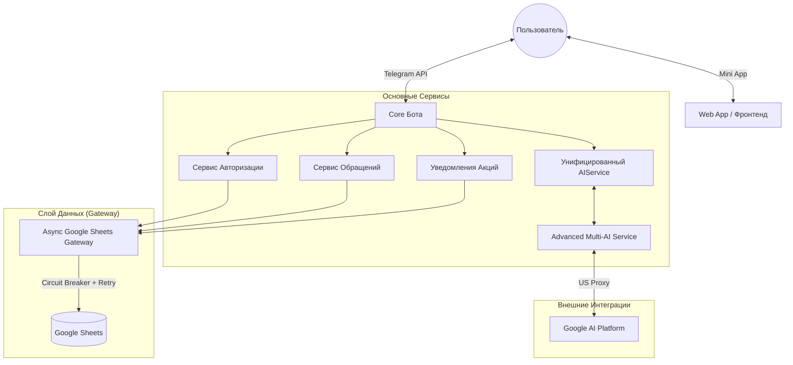

# Техническая Документация (v.Current)

> **Статус:** Активен / Стабилен
> **Последнее обновление:** 2026-01-16
> **Роль:** Единый Источник Истины (Single Source of Truth)

---

## 1. Высокоуровневая Архитектура

Проект представляет собой отказоустойчивый **Telegram-бот**, написанный на Python, разработанный для высокой доступности (24/7). Он работает как монолитное приложение с модульными сервисами, используя **Google Sheets** в качестве основной базы данных и **Google Gemini** как единственный ИИ (без резервных провайдеров).

### Технологический Стек
*   **Язык:** Python 3.12+
*   **Фреймворк:** `python-telegram-bot` (v20+, Async)
*   **База Данных:** Google Sheets (через `gspread` + `tenacity` для повторных попыток)
*   **ИИ Движок:** Только Gemini (модель `gemini-3-flash-preview`)
*   **Сетевая связность:** Только US-прокси для запросов Gemini (без OpenRouter/других провайдеров)
*   **Развертывание:** Systemd Service (Linux/Ubuntu)

### Диаграмма Архитектуры (Логическая)



### Ключевые Архитектурные Решения
1.  **Паттерн Gateway:** Все взаимодействия с Google Sheets проходят через `AsyncGoogleSheetsGateway`. Этот слой управляет лимитами запросов, повторными попытками (экспоненциальная задержка) и стабильностью соединения.
2.  **Circuit Breaker (Предохранитель):** Реализован для предотвращения каскадных сбоев. Если Google Sheets перестает отвечать, бот временно ограничивает функционал, а не падает полностью.
3.  **Graceful Shutdown (Плавная остановка):** Бот обрабатывает сигналы `SIGINT`/`SIGTERM` для безопасного закрытия соединений и сохранения состояния перед выходом.
4.  **Отсутствие Локальной БД:** Система не хранит персистентные данные локально; все бизнес-данные находятся в Google Sheets. Состояние выполнения хранится в памяти.

---

## 2. Структура Данных

"База данных" подразумевает конкретную Google Таблицу с несколькими листами.

### 2.1 Лист Auth (Пользователи)
Хранит реестр пользователей и статус авторизации.

| Колонка | Имя (Заголовок) | Описание |
| :--- | :--- | :--- |
| **A** | *Код партнера* | Уникальный идентификатор партнера. (Используется для поиска) |
| **B** | *Телефон* | Номер телефона партнера. (Используется для поиска) |
| **C** | *ФИО* | Полное имя. |
| **D** | **STATUS** | Статус авторизации (`authorized` / `avtorizovan`). |
| **E** | **Telegram ID** | Привязанный ID пользователя Telegram. |
| **F** | **Updated At** | Временная метка последнего изменения авторизации. |

#### Синхронизация данных
Данные в этот лист попадают из источника (`1. 3. список сотрудников для авто`) автоматически. 
Для этого используется **Google Apps Script**, привязанный к таблице.

*   **Файл со скриптом в проекте:** `AUTHORIZATION_SHEET_SCRIPT.js`
*   **Функция:** `syncEmployeeList()` (доступна через меню «👥 Управление доступом»)

> **Примечание:** Авторизация ищет пользователя по совпадению `Код партнера` И `Телефон`. Если найдено, обновляются колонки D, E, F.

### 2.2 Лист Appeals (Обращения)
Хранит тикеты поддержки и историю чата.

| Колонка | Индекс | Заголовок | Описание |
| :--- | :--- | :--- | :--- |
| **A** | 0 | Code | Код партнера. |
| **B** | 1 | Phone | Телефон. |
| **C** | 2 | FIO | ФИО. |
| **D** | 3 | Telegram ID | ID пользователя Telegram. |
| **E** | 4 | **Text** | **Накопленная История**. Содержит весь лог чата для активного тикета. |
| **F** | 5 | **Status** | Статус тикета (см. ниже). |
| **G** | 6 | Specialist Answer| Черновик ответа от специалиста (для отправки ботом). |
| **H** | 7 | Updated At | Временная метка последнего изменения. |

#### Жизненный цикл Статуса (Колонка F)
*   `Новое` (Цвет: #f3cccc) — Создано пользователем, ждет ИИ или Человека.
*   `Ответ ИИ` (Цвет: #ffffff) — ИИ ответил.
*   `В работе` (Цвет: #fff2cc) — Взято в работу специалистом (или запрошен "Человек").
*   `Передано специалисту` (Цвет: #f3cccc) — Явная эскалация.
*   `Решено` (Цвет: #d9ead3) — Тикет закрыт.

---

## 3. Бизнес-Логика и Алгоритмы

### 3.1 Флоу Авторизации
1.  Пользователь запускает бота через `/start`.
2.  **Проверка:** `AuthService` проверяет `TTLCache` (в памяти) или запрашивает Лист Auth по `Telegram ID`.
3.  **Если Неизвестен:** Бот запрашивает Авторизацию через Web App (Mini App).
4.  **Web App:** Пользователь вводит `Код` и `Телефон`.
5.  **Валидация:** Бот нормализует телефон (например, `8999...`), ищет в Листе Auth.
6.  **Успех:** Если совпадение найдено -> Обновить Лист (Кол D, E, F) -> Обновить Кэш -> Показать Меню.
7.  **Ошибка:** Показать ошибку и кнопку повтора.

### 3.2 Чат и Флоу ИИ (Гибридный)
1.  **Ввод:** Пользователь отправляет текстовое сообщение.
2.  **Фильтр:** Это ключевое слово эскалации (например, "позови человека")?
    *   *Да:* Остановить ИИ, установить Статус `Передано специалисту`, показать кнопку "Связаться со специалистом".
3.  **Проверка Статуса:** Текущий статус тикета `В работе`?
    *   *Да:* ИИ молчит. Логировать сообщение в Лист (Кол E). Ждать ответа человека.
4.  **Выполнение ИИ:**
    *   Отправить текст в **Advanced Multi-AI System** (Ротация: DeepSeek -> Gemini -> Qwen -> Llama).
    *   Получить ответ.
    *   **Пост-процессинг:** Проверить, не предлагает ли ИИ эскалацию ("Вас соединить?").
    *   **Отправка:** Ответ пользователю + Лог в Лист (Кол E) + Установить Статус `Ответ ИИ`.

### 3.3 Ответ Специалиста (Обратный Флоу)
1.  **Мониторинг:** `ResponseMonitor` опрашивает Лист Appeals (Кол G) каждые 60 сек.
2.  **Триггер:** Специалист пишет текст в Колонку G.
3.  **Действие:**
    *   Бот отправляет текст Пользователю по `telegram_id` (из Кол D).
    *   Бот очищает Колонку G.
    *   Бот добавляет текст в Историю (Кол E).

---

## 4. Интеграции и API

### 4.1 Внутренние Сервисы
*   **Google Sheets API:** Аутентификация через JSON Сервисного Аккаунта (`GCP_SA_FILE`).
*   **Advanced Multi-AI System:**
    *   **Gemini API:** Использует `GEMINI_API_KEYS` (пул для ротации) и модель `gemini-2.0-flash`.
    *   **OpenRouter API:** ОТКЛЮЧЕН (резервные ИИ-подключения не используются).
    *   **Поддержка Прокси:** Настраивается через `PROXYAPI_BASE_URL` для обхода ограничений в РФ (только для Gemini).

### 4.2 Вебхуки и Mini App
*   **Эндпоинт:** `/webhook/promotions` (Flask/Werkzeug).
*   **Цель:** Принимает POST запросы (например, от триггеров Google Apps Script) для рассылки акций.
*   **Mini App:** Статические HTML/JS файлы (`index.html`, `menu.html`), загружаемые внутри Telegram WebObject.

### 4.3 История Разработки
*   Полная история технических решений, новых функций и версий отслеживается в [CHANGELOG.md](CHANGELOG.md).
*   Смотрите **CHANGELOG**, чтобы увидеть эволюцию от начального прототипа до текущей микро-сервисной архитектуры.

---

## 5. Руководство по Развертыванию и Разработке

### 5.1 Структура Проекта (Карта Файлов)
Для начинающего разработчика, вот за что отвечает каждый файл:
*   `bot.py`: **Двигатель**. Запускает бота, соединяет сервисы, обрабатывает ошибки. Начинайте отсюда.
*   `handlers.py`: **Мозг**. Содержит логику для `/start`, сообщений чата и кнопок. Редактируйте здесь, чтобы изменить *что* говорит бот.
*   `auth_service.py`: **Охрана**. Проверяет права пользователя в Google Sheets.
*   `appeals_service.py`: **Система Тикетов**. Логика создания/обновления тикетов в Таблицах.
*   `sheets_gateway.py`: **Драйвер Базы**. Низкоуровневый коннектор к Google Sheets с защитой от сбоев.
*   `gemini_service.py`: **Коннектор ИИ**. Реализует логику пулов, ротации и fallback между ИИ провайдерами.

### 5.2 Настройка Локального Окружения (Пошагово)
1.  **Установите Python 3.10+**.
2.  **Клонируйте проект** на свой компьютер.
3.  **Создайте Виртуальное Окружение** (Изолированная песочница):
    ```bash
    python3 -m venv .venv
    source .venv/bin/activate  # На Windows: .venv\Scripts\activate
    ```
4.  **Установите Зависимости**:
    ```bash
    pip install -r requirements.txt
    ```
5.  **Настройте Секреты**:
    *   Скопируйте `.env.example` в `.env`.
    *   Заполните `TELEGRAM_TOKEN`, `SHEET_ID` и т.д.
    *   **Важно:** Если запускаете в Яндекс Облаке, установите `OPENAI_PROXY`.
    *   Убедитесь, что `credentials.json` (Google Service Account) лежит в папке проекта.
6.  **Запустите Бота**:
    ```bash
    python bot.py
    ```
    *Если успешно, вы увидите "Запуск бота..." в консоли.*

### 5.3 Типовые Сценарии Изменений

#### Сценарий А: Изменить Приветственное Сообщение
1.  Откройте `handlers.py`.
2.  Найдите `start_command_handler`.
3.  Отредактируйте текст внутри `await update.message.reply_text("...")`.
4.  Перезапустите бота (`Ctrl+C`, затем `python bot.py`), чтобы увидеть изменения.

#### Сценарий Б: Добавить Новую Команду (например, /help)
1.  Откройте `handlers.py`.
2.  Создайте функцию `async def help_command(update, context): ...`.
3.  Перейдите к функции `setup_handlers` в `handlers.py`.
4.  Добавьте `application.add_handler(CommandHandler("help", help_command))`.

#### Сценарий В: Дебаг "Почему бот упал?"
1.  Проверьте файл `bot.log`.
2.  Ищите строки с "CRITICAL" или "ERROR".
3.  Если ошибка связана с Google Sheets, проверьте логи `sheets_gateway.py`.

---

## 6. Продакшн Развертывание (Сервер)

Бот работает на **Виртуальной Машине Яндекс Облака** (Ubuntu/Linux), используя **Systemd** как менеджер сервисов.

### Полезные Команды
*   **Проверить Статус:** `sudo systemctl status marketingbot`
    *   *Зеленый (active)* = Хорошо.
    *   *Красный (failed)* = Упал. Читайте логи.
*   **Перезапустить Бот:** `sudo systemctl restart marketingbot`
    *   Запускайте это после *каждого* обновления кода на сервере.
*   **Смотреть Логи в Реал-тайме:** `journalctl -u marketingbot -f`

---

## Приложение: Google Drive (папки)

Ниже зафиксированы ссылки на папки Google Drive, которые используются в проекте:

- **Папка обращений:** `1BMgJ-hjUh9pMRzBg_cGgHrHkb-KZjRPt`
- **Папка авторизации:** `1dWsMQ8pWjh1qhjLaj8-LYqT8a-9rWU25`
- **Папка акций:** `1HVvNRrRLDbPpxHx5gwFPw0r55O3jTkrv`
- **Папка базы знаний:** `1JKjzWs3or3hn5ioCIqPBGHkZmgIN-OFf`

Важно: для настройки `SHEET_ID`, `APPEALS_SHEET_ID`, `PROMOTIONS_SHEET_ID` нужны ID конкретных таблиц Google Sheets
(`https://docs.google.com/spreadsheets/d/<SHEET_ID>/edit`), а не папок.

---

## Приложение: Google Sheets (ID таблиц)

Актуальные ID таблиц:

- **Авторизация (SHEET_ID):** `1_SB04LMuGB7ba3aog2xxN6N3g99ZfOboT-vdWXxrh_8`
- **Обращения (APPEALS_SHEET_ID):** `15XxSIpD_gMZaSOIrqDVCNI2EqBzphEGiG0ZNJ3HR8hI`
- **Акции (PROMOTIONS_SHEET_ID):** `1V3-cPRq_SmbCbIzn1-CWSqD8pdpDqraq_GJ7LjMmwf8`

---

## Приложение: Gemini (модель и ключи)

- **Модель:** `gemini-3-flash-preview`
- **Ключ API:** хранится только в `.env` (не фиксируется в документации).
