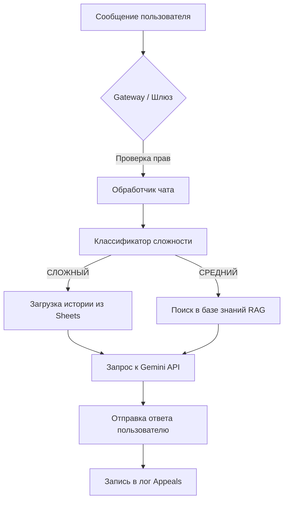

# 📖 Итоговый отчет и Руководство MarketingBot

Добро пожаловать в MarketingBot! Этот документ разделен на две части: **функциональную** (возможности и инструкции для пользователей) и **техническую** (архитектура и надежность для владельцев системы).

---

# ЧАСТЬ 1. Функциональный блок (Для пользователей)

В этой части описано всё, что умеет делать бот, и как пользоваться его функциями в ежедневной работе.

## 1. Карта возможностей системы
### Световая карта возможностей (Mind Map)

---

## 2. Ваш ассистент Галина (Искусственный Интеллект)

Галина — это "умный" помощник на базе технологий Google Gemini, специально обученный на ваших корпоративных данных.

### Логическая цепочка работы ИИ:
1.  **Запрос:** Вы вводите вопрос в чат (например, "Как оформить аккредитацию?").
2.  **Поиск:** Галина мгновенно "пролистывает" все инструкции и регламенты в своей базе знаний.
3.  **Анализ:** Она сопоставляет ваш вопрос с найденной информацией.
4.  **Ответ:** Вы получаете четкий, сформулированный ответ со ссылками на нужные документы.

### Когда Галина зовет человека?
Если ИИ понимает, что вопрос требует живого участия:
*   Вы нажали кнопку **«Обратиться к специалисту»** или написали «Нужен менеджер».
*   **Цепочка эскалации:** Галина прекращает отвечать -> Ваш чат помечается в таблице статусом "В работе" -> Специалист заходит в чат и продолжает диалог от лица бота.

---

## 3. Модуль «Аналитика 360»

Инструмент для мгновенного анализа объектов недвижимости прямо в Telegram.

### Логическая цепочка аналитики:
1.  **Ввод данных:** Вы вводите код объекта в Mini App.
2.  **Запуск расчетов:** Бот передает этот код в систему анализа, которая "сканирует" рынок.
3.  **Сравнение:** Система находит 10-20 похожих объектов-конкурентов.
4.  **Финальный отчет:** Вы получаете сообщение с главными цифрами и кнопкой для скачивания полного PDF-файла.

### Процесс работы (Инфографика)

---

## 4. Мониторинг Акций и Уведомления

### Логическая цепочка уведомлений:
1.  **Обновление данных:** Маркетолог вносит новую акцию в Google Таблицу.
2.  **Обнаружение:** Бот при очередном обходе (каждые 30 мин) видит новую запись.
3.  **Рассылка:** Бот отправляет сообщение всем авторизованным пользователям одновременно.
4.  **Результат:** Вы узнаете об акции первым, не заходя в таблицу.

---

## 5. Система Обращений и Прозрачность

### Логика ведения истории:
1.  **Фиксация:** Каждое ваше сообщение (текст, фото, файл) записывается в личную историю в Google Таблицах.
2.  **Синхронизация:** Если вы переустановили Telegram или зашли с другого устройства, Галина всё равно "помнит", о чем вы говорили ранее, так как она читает историю из облака.
3.  **Контроль:** Специалист видит всю цепочку вашего общения с ботом, что помогает ему быстрее вникнуть в проблему.

---

## 6. Часто задаваемые вопросы (How-to)

*   **Как получить точный ответ?** Пишите конкретно (название ЖК, месяц, название акции).
*   **Бот не отвечает?** Проверьте, не передан ли ваш запрос специалисту.
*   **Админам:** Для обновления базы знаний используйте команду `/refresh_kb`.

---
---

# ЧАСТЬ 2. Технический блок (Для владельцев и IT)

В этой части описаны внутренние механизмы, которые делают MarketingBot надежным и быстрым инструментом.

## 7. Архитектура и Взаимодействие
### Путь данных (System Interaction):

---

## 8. Интеллектуальные алгоритмы

### Цепочка принятия решений (Каскады):
1.  **Вход:** Поступает текст длиной N символов.
2.  **Уровень 1 (Simple):** Проверка по шаблонам (Привет, Пока). Если совпало — ответ мгновенный (100 мс).
3.  **Уровень 2 (Medium):** Если есть технические маркеры (Как, Почему) — поиск в векторной базе знаний.
4.  **Уровень 3 (Complex):** Если запрос требует анализа — сбор контекста за последние 5 сообщений + RAG + Генерация.

---

## 9. Надежность и Стабильность

### Алгоритм "Защищенного доступа" (Circuit Breaker):
1.  **Запрос к БД:** Бот запрашивает данные из Google Sheets.
2.  **Ошибка/Таймаут:** Если БД не отвечает более 5 секунд, "защитник" включает режим ожидания.
3.  **Повтор:** Включается цепочка `Tenacity` (автоповторы: 1с -> 3с -> 10с).
4.  **Fallback:** Если таблица "легла" окончательно, пользователь получает вежливое сообщение о тех-работах, а админ — критическое уведомление в Telegram.

---

## 10. Технология обновлений (Blue-Green Stability)

### Алгоритм бесшовного обновления:
1.  **Сборка:** Новая версия кода скачивается в папку `releases/новое_время`.
2.  **Тест:** Внутри новой папки запускается "Smoke Test" (проверка, что бот вообще может включиться).
3.  **Переключение:** Если тест пройден, симлинк `current` мгновенно меняет направление на новую папку.
4.  **Перезапуск:** Сервис `systemd` перезагружает бота. Процесс занимает < 2 секунд.

---
*MarketingBot — профессиональное решение для автоматизации маркетинга и аналитики.*
