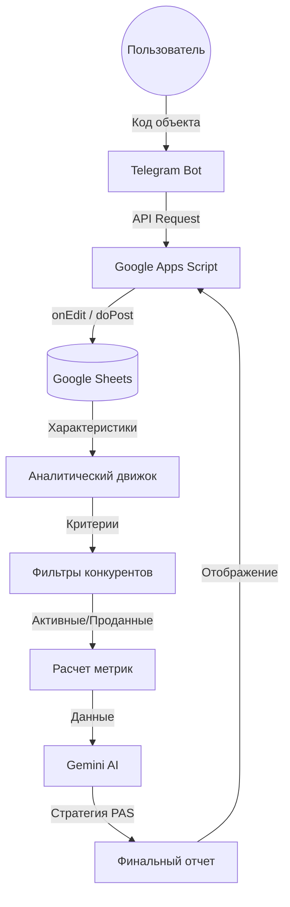

# ДОКУМЕНТАЦИЯ ПРОЕКТА: УНИВЕРСАЛЬНЫЙ АНАЛИЗАТОР НЕДВИЖИМОСТИ

## ОБЩАЯ КОНЦЕПЦИЯ

**Цель:** Создать универсальный инструмент анализа недвижимости для любого риэлтора в компании через чат-бот.

**Текущее состояние:** Система работает только для одной группы объектов
**Целевое состояние:** Любой риэлтор может проанализировать свой объект по коду

---

## АРХИТЕКТУРА СИСТЕМЫ

Система построена на модульной архитектуре, где Google Sheets выступает в роли "фронтенда" и базы данных, а Apps Script — в роли "бэкенда" и аналитического движка с интеграцией ИИ.

---

## СТРУКТУРА ЛИСТОВ

### ТЕКУЩИЕ ЛИСТЫ (остаются)
- `1. 2. проданные` - все проданные объекты за период
- `2. 2. активные` - все активные объекты (конкуренты)
- `3. 56. авито` - реклама на Авито
- `5. 56. циан` - реклама на Циан
- `6. 56. домклик` - реклама на Домклик

### НОВЫЕ ЛИСТЫ (создать)
- `аналитика ОН по коду` - входная точка (было "аналитика ОН по адресу/коду")
- `аналитика ОН по адресу` - для будущего функционала
- `лист анализа объекта` - аналог "аналитика всех ОН в группе" для одного объекта
- `конкуренты активные и проданные для анализа` - аналог массива конкурентов для одного объекта

---

## ПОТОК ДАННЫХ

### 1. ВВОД ДАННЫХ
- Пользователь отправляет код объекта в чат-бот
- Код попадает в ячейку B2 листа "аналитика ОН по коду"
- Срабатывает триггер onEditTrigger()

### 2. ПОИСК ОБЪЕКТА
- Скрипт ищет код объекта на листе "2. 2. активные"
- Извлекает данные объекта (все характеристики)

### 3. СОЗДАНИЕ СТРУКТУРЫ АНАЛИЗА
- Скрипт создает структуру на листе "лист анализа объекта"
- Заголовки во второй строке (жесткая структура)

### 4. АНАЛИЗ КОНКУРЕНТОВ
- Формируется массив конкурентов на листе "конкуренты активные и проданные для анализа"
- Фильтрация по критериям из листов "2. 2. активные" и "1. 2. проданные"

### 5. РАСЧЕТ АНАЛИТИКИ
- Анализ по тем же критериям, что и в текущей системе
- Расчет метрик, прогнозов, ценовых стратегий

### 6. ВЫВОД ОТЧЕТА
- Данные выводятся на лист "аналитика ОН по коду" начиная с 4 строки
- Аналогично текущему листу "аналитика ОН по адресу/коду"

---

## КРИТЕРИИ АНАЛИЗА (из текущего кода)

### ФИЛЬТРАЦИЯ КОНКУРЕНТОВ
1. **Тип объекта** - точно совпадает
2. **Количество комнат** - ±1 (допуск)
3. **Площадь** - ±20% (допуск)
4. **Год постройки** - ±10 лет (допуск)
5. **Район** - точно совпадает
6. **Ремонт** - если у объекта хороший ремонт, то и у конкурента должен быть хороший
7. **Дата** - только свежие объявления (не старше 6 месяцев)

### РАСЧЕТНЫЕ МЕТРИКИ
- **Спрос** - количество проданных объектов в месяц
- **Конкуренция** - количество активных конкурентов
- **Ликвидность** - тип (A+, A, B, C, C-)
- **Тренды цен** - рост/снижение/стабильность
- **Позиционирование** - ранг по цене
- **Ценовые стратегии** - быстрая/рыночная/оптимистичная + сроки

---

## ТЕХНИЧЕСКАЯ РЕАЛИЗАЦИЯ

### НОВЫЕ ФУНКЦИИ (создать)
1. `findObjectByCode(code)` - поиск объекта по коду
2. `createAnalysisStructure()` - создание структуры анализа
3. `analyzeSingleObject(objectData)` - анализ одного объекта
4. `generateSingleObjectReport(objectData)` - генерация отчета

### МОДИФИКАЦИЯ СУЩЕСТВУЮЩИХ ФУНКЦИЙ
1. `onEditTrigger()` - адаптация для нового листа
2. `findCompetitorsForAllObjects()` - создание версии для одного объекта
3. `generateFullReport()` - адаптация для нового потока

---

## ПОШАГОВЫЙ ПЛАН РЕАЛИЗАЦИИ

### ЭТАП 1: ПОДГОТОВКА (1-2 дня)
- [ ] Изучить структуру листов "2. 2. активные" и "1. 2. проданные"
- [ ] Создать новые листы в Google Таблице
- [ ] Настроить заголовки и структуру

### ЭТАП 2: БАЗОВАЯ ФУНКЦИОНАЛЬНОСТЬ (3-4 дня)
- [ ] Реализовать поиск объекта по коду
- [ ] Создать функцию анализа одного объекта
- [ ] Адаптировать фильтрацию конкурентов

### ЭТАП 3: АНАЛИТИКА (2-3 дня)
- [ ] Перенести все расчетные функции
- [ ] Адаптировать генерацию отчета
- [ ] Протестировать на реальных данных

### ЭТАП 4: ИНТЕГРАЦИЯ (1-2 дня)
- [ ] Настроить триггеры
- [ ] Интегрировать с чат-ботом
- [ ] Финальное тестирование

---

## ПЕРЕМЕННЫЕ И ДАННЫЕ

### ВХОДНЫЕ ДАННЫЕ
- `code` - код объекта (строка)
- `objectData` - данные объекта из "2. 2. активные"
- `activeCompetitors` - массив активных конкурентов
- `soldCompetitors` - массив проданных конкурентов

### ВЫХОДНЫЕ ДАННЫЕ
- `analyticsData` - рассчитанные метрики
- `competitorsData` - отфильтрованные конкуренты
- `reportData` - структурированный отчет

---

## КРИТИЧЕСКИЕ МОМЕНТЫ

1. **Производительность** - анализ одного объекта должен быть быстрым
2. **Точность** - критерии фильтрации должны быть идентичными текущим
3. **Совместимость** - не сломать существующую функциональность
4. **Масштабируемость** - система должна работать при росте базы данных

---

## ВЫПОЛНЕННЫЕ ЭТАПЫ

### ✅ ЭТАП 1: ИЗУЧЕНИЕ СТРУКТУРЫ ДАННЫХ
- Изучена структура листа "2. 2. активные" (A2:O2)
- Изучена структура листа "1. 2. проданные" (A2:O2)
- Определены индексы столбцов для кода объекта (F в обоих листах)
- Изучена структура рекламных листов (3.56, 5.56, 6.56)

### ✅ ЭТАП 2: СОЗДАНИЕ НОВЫХ ЛИСТОВ
- Создан лист "аналитика ОН по коду" (переименован из "аналитика ОН по адресу/коду")
- Создан лист "лист анализа объекта" 
- Создан лист "конкуренты активные и проданные для анализа"

### ✅ ЭТАП 3: ФУНКЦИЯ НАСТРОЙКИ ЛИСТОВ
- Добавлена функция "🔧 Настроить новые листы" в меню
- Создана функция `setupNewSheets()` - настраивает все новые листы

### ✅ ЭТАП 4: ФУНКЦИИ АНАЛИЗА ОДНОГО ОБЪЕКТА
- Реализована функция `findObjectByCode()` для поиска объекта по коду
- Создана функция `buildSingleObjectCompetitorsArray()` для построения массива конкурентов
- Реализована функция `analyzeSingleObject()` для анализа одного объекта
- Создана функция `generateSingleObjectReport()` для генерации отчета
- **АВТОМАТИЧЕСКИЙ ТРИГГЕР** - анализ запускается автоматически при заполнении ячейки B2
- **ИСПРАВЛЕНА МЕТОДОЛОГИЯ** - добавлен фильтр по району, исправлен временной фильтр (6 месяцев)
- **ИЗМЕНЕН ИСТОЧНИК ДАННЫХ** - поиск в "4. 2. активные в группе" (наши объекты)
- **ДОБАВЛЕНЫ ВСЕ МЕТРИКИ** - полный набор аналитических показателей как в оригинале
- **ИНТЕГРАЦИЯ С ИИ** - добавлен API ключ Gemini и автоматическая генерация отчетов с ИИ ассистентом
- Создана функция `setupSingleObjectAnalyticsSheet()` - настраивает лист "аналитика ОН по коду"
- Создана функция `setupAnalysisObjectSheet()` - настраивает лист "лист анализа объекта"
- Создана функция `setupCompetitorsAnalysisSheet()` - настраивает лист конкурентов
- Добавлены новые константы в SHEETS для новых листов
- **ПРОТЕСТИРОВАНО** - все функции работают корректно

### ✅ ЭТАП 5: СИСТЕМА ОТЧЕТОВ И ИИ
- Реализована функция `generateSingleObjectReport()` для генерации отчета.
- Интегрирована модель Gemini (Flash/Pro) для генерации текстового описания по модели PAS.
- Добавлена динамическая верстка отчета (автоподбор высоты строк).

### ✅ ЭТАП 6: ИНТЕГРАЦИЯ С ЧАТ-БОТОМ
- Настроен эндпоинт `doPost()` для обработки запросов от бота.
- Реализована двусторонняя связь: бот передает код -> скрипт анализирует -> бот получает ссылку на отчет.

## БУДУЩИЕ ДОРАБОТКИ (ROADMAP)

### 1. Анализ по адресу
- Интеграция с DaData для нормализации адресов.
- Геокодирование для поиска конкурентов в радиусе (а не только по району).

### 2. Расширенная визуализация
- Генерация графиков (тренды цен, распределение конкурентов) внутри Google Sheets.
- Экспорт отчета в PDF.

### 3. Продвинутый маркетинг
- Модуль генерации рекламных объявлений для Авито/Циан на основе анализа сильных сторон объекта.

---

*Документация обновлена по состоянию на текущий момент*
